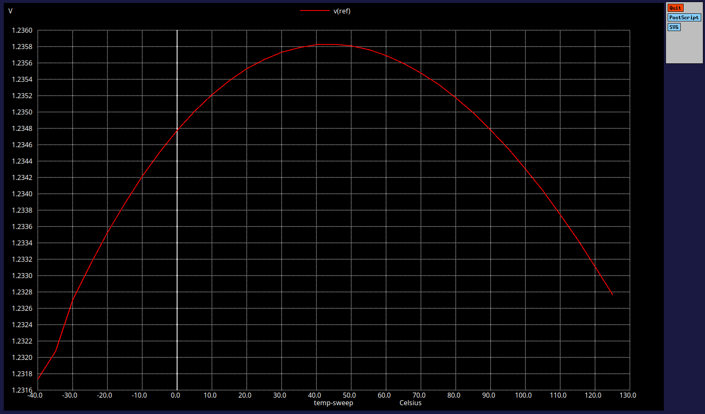
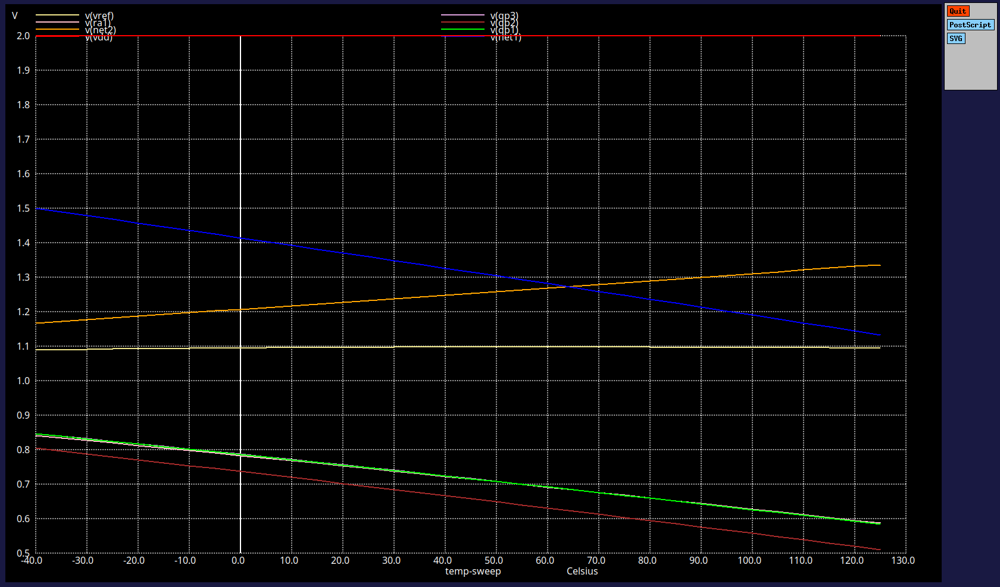
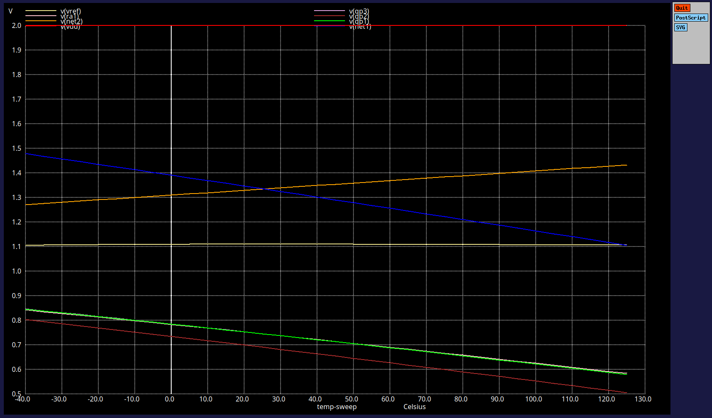
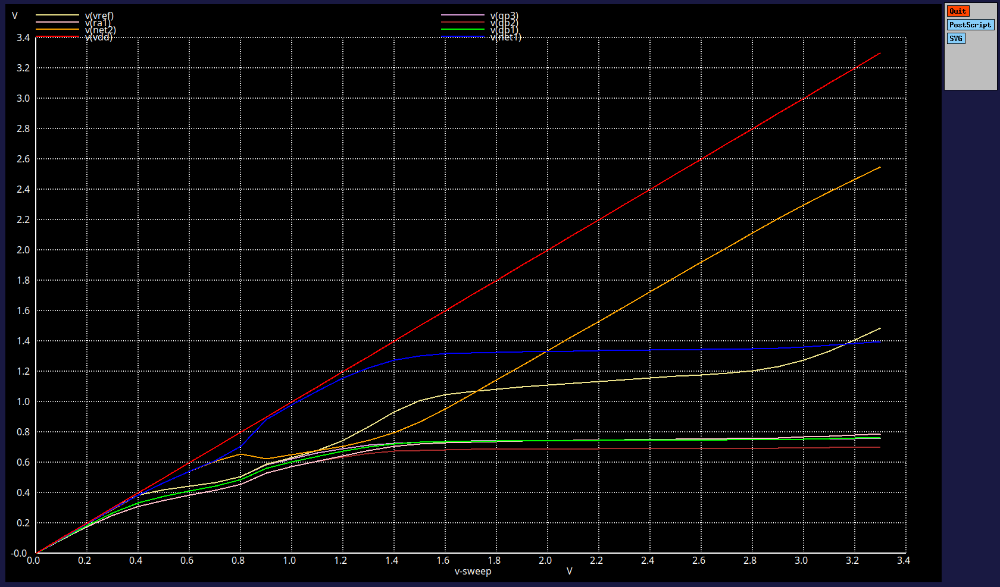
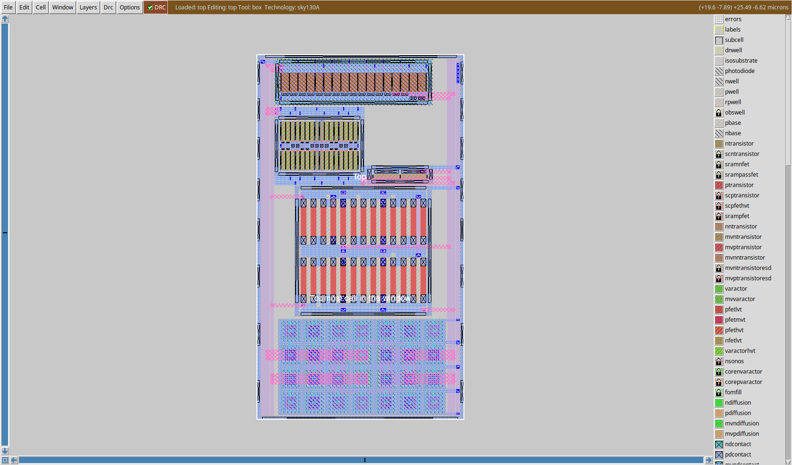

# Bandgap Reference (BGR) IP Design using Sky130

**Technology Node:** SkyWater 130nm (Sky130)
**Tools:** NgSpice, Magic VLSI, Netgen

## 1. Project Overview
This project focuses on the design and pre-layout simulation of a **Bandgap Voltage Reference (BGR)** circuit. The goal was to achieve a stable reference voltage independent of Process, Voltage, and Temperature (PVT) variations, which is critical for sub-systems such as LDOs, ADCs, and DACs.

The design implements a **Self-Biased Current Mirror (SBCM)** topology to ensure high Power Supply Rejection Ratio (PSRR) and stability, along with a dedicated start-up circuit to prevent degenerate bias points.

## 2. Theory of Operation (Summary)
The BGR operates by summing two voltages with opposing temperature coefficients (TC) to achieve a near-zero TC at the output:
1.  **CTAT (Complementary to Absolute Temperature):** Derived from the Base-Emitter voltage ($V_{BE}$) of a PNP BJT. As temperature rises, $V_{BE}$ decreases.
2.  **PTAT (Proportional to Absolute Temperature):** Derived from the difference in $V_{BE}$ ($\Delta V_{BE}$) between two BJTs with different current densities ($1:N$ ratio). As temperature rises, $\Delta V_{BE}$ increases.

**Governing Equation:**
$$V_{REF} = V_{BE} + K \cdot \Delta V_{BE}$$
*By tuning the gain factor $K$ (via resistor ratios), the positive and negative slopes cancel out.*

## 3. Pre-Layout Simulation (NgSpice)

All circuit simulations were performed using **NgSpice**. The design was rigorously tested across different process corners (TT, SS, FF) and operating conditions to ensure robustness.

### 3.1 Design Components & Sizing
* **Transistors:** 1.8V LVT MOSFETs (`sky130_fd_pr__nfet_01v8_lvt`, `pfet`).
* **BJTs:** PNP (`sky130_fd_pr__pnp_05v5`) configured as diodes.
* **Resistors:** High Poly Resistors (`sky130_fd_pr__res_high_po`) for low TC.

### 3.2 DC Analysis (Temperature Sweep)
**Objective:** Verify temperature independence of $V_{REF}$ from -40°C to 125°C.

* **Corner TT (Typical-Typical):**
    * The simulation exhibits the characteristic "umbrella" curve, confirming successful first-order temperature compensation within the target specifications.
    

* **Corner SS (Slow-Slow):**
    * The design maintains stability and functionality even under slower process conditions, with the reference voltage remaining within acceptable limits.
    

* **Corner FF (Fast-Fast):**
    * Indicates robust performance with optimal temperature coefficient characteristics, showing minimal variation across the temperature range.
    

### 3.3 DC Supply Sweep (Start-up Verification)
**Objective:** Verify the start-up circuit functionality ensuring $V_{REF}$ stabilizes once $V_{DD}$ reaches the operating level.

* **Start-up Behavior:** The simulation confirms that the circuit successfully snaps out of the zero-current state and stabilizes at ~1.2V once the supply voltage exceeds ~1.4V.

## 4. Physical Design (Layout)

The layout was created using **Magic VLSI** with a focus on matching and symmetry.

* **Matching:** Critical BJTs and resistors utilize common-centroid placement to minimize process gradients.
* **LVS Status:** **Clean**. The layout netlist matches the schematic netlist uniquely (Verified via Netgen).

## 5. Work in Progress: Post-Layout Verification

* **Current Status:** Layout vs. Schematic (LVS) is clean.
* **Pending:** Parasitic Extraction (PEX) and Post-Layout Simulation (PLS).
* **Next Steps:**
    * Debug parasitic capacitance extraction issues in Magic.
    * Run transient and DC sweeps on the extracted netlist to quantify the impact of interconnect resistance and capacitance on the Temperature Coefficient.
